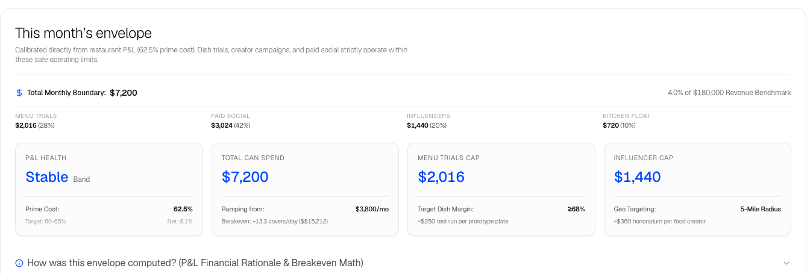
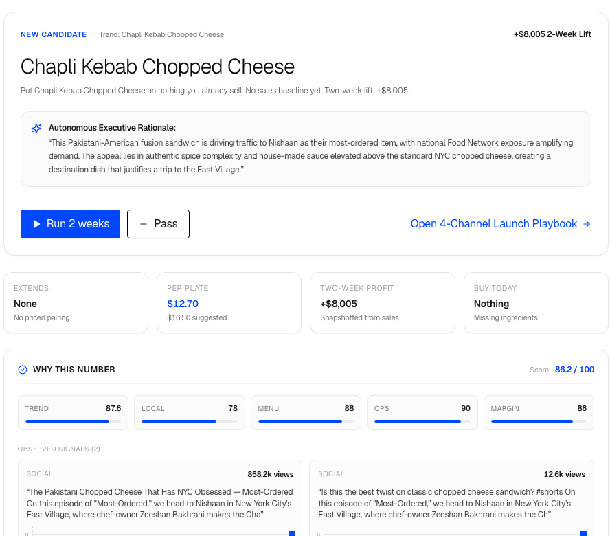
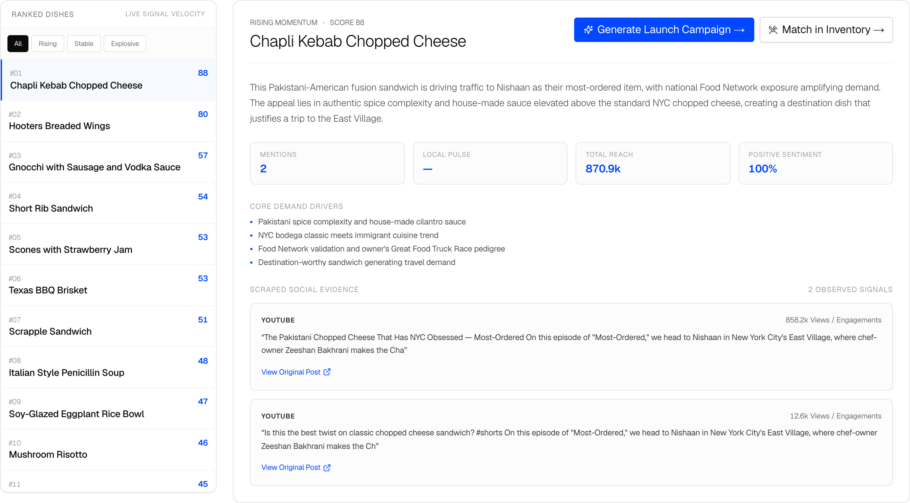
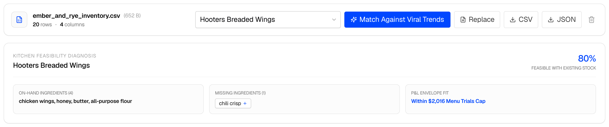
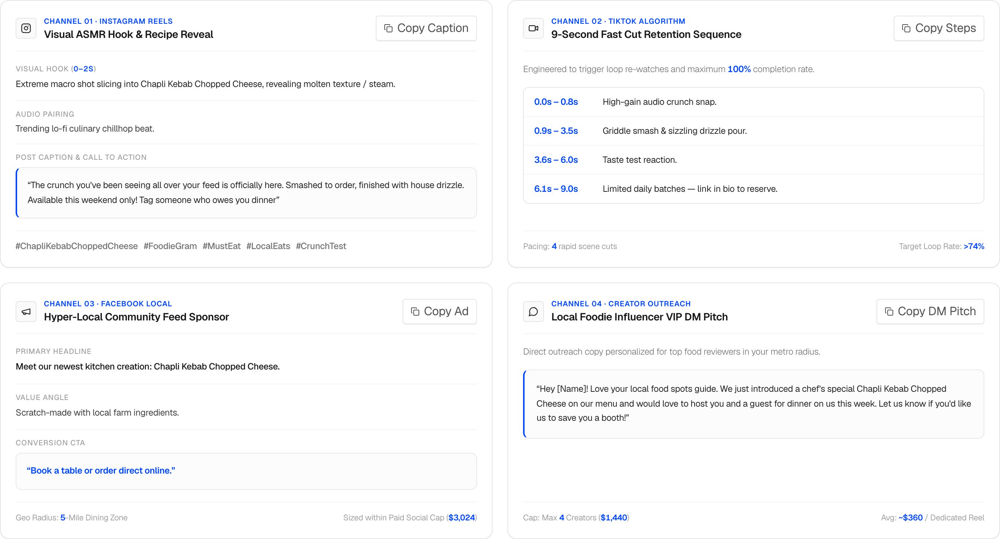

# MiseEnVue

MiseEnVue connects culinary trend intelligence with restaurant financial constraints. It derives strict operational spending envelopes directly from restaurant P&L statements and pairs them with viral food trends to propose feasible, high-margin menu specials.

---

## System Architecture

The platform operates across three decoupled modules:

| Module | Component | Execution Model | Primary Output |
|---|---|---|---|
| **Financial Calibration** | `finance.budget` | Python batch | `data/out/budget.json` |
| **Trend Ingestion** | `ingestion.pipeline` | Python batch | `data/out/trends.json` |
| **Decision Studio** | Next.js 16 (App Router) | Interactive web application | Feasibility matrix & campaign playbooks |

Neither backend pipeline runs within HTTP request cycles. The web interface directly consumes schema-versioned JSON contracts, ensuring instantaneous responses, verifiable provenance, and offline reliability.

---

## Core Cockpit Modules & Widgets

### 1. Financial Spending Envelope

Calibrates safe capital boundaries directly from restaurant profit-and-loss statements to prevent overspending on unproven menu experiments.

- **P&L Health Tracking**: Automatically categorizes operational stability based on prime cost benchmarks (target: 60-65%).
- **Hard Capital Caps**: Enforces non-negotiable boundaries for menu ingredient trials ($2,016), creator tasting honorariums ($1,440), and paid media ($3,024).
- **Zero Capex Guarantee**: Eliminates recommendations requiring new cooking equipment, restricting innovation to existing line stations.

---

### 2. Autonomous Decision Card & 5-Factor Scorecard

Synthesizes viral candidates with kitchen capacity to generate executive go/no-go recommendations and two-week incremental profit projections.

- **5-Factor Scorecard Engine**: Evaluates every opportunity across Trend Strength, Local Relevance, Menu Fit, Operational Compatibility, and Contribution Margin.
- **Unit Economics**: Calculates per-plate food cost ($12.70), suggested menu price ($16.50), and net margin lift (+$8,005 over two weeks).
- **Observed Signals Slider**: Allows operators to scrub through authentic social evidence, review volume, and guest sentiment quotes.

---

### 3. Demand Radar & Trend Discovery

Scans creator velocity across food media channels to detect breakout culinary concepts before they reach saturation.

- **Breakout Multiplier**: Measures upload view velocity against creator median views to separate genuine virality from baseline audience reach.
- **Momentum Filtering**: Categorizes trends by trajectory (Rising, Stable, Explosive) to help operators time menu launches.
- **Verifiable Provenance**: Every dish card links to timestamped video clips, engagement metrics, and regional dining commentary.

---

### 4. Walk-In Inventory & Recipe Feasibility Diagnosis

Audits existing restaurant inventory against trending recipes using client-side CSV parsing.

- **Pantry Coverage Scoring**: Computes the percentage of required recipe ingredients already present in the walk-in cooler (e.g., 80% in-stock).
- **Missing SKU Detection**: Identifies unstocked specialty ingredients and calculates incremental cost to test.
- **One-Click Procurement**: Adds missing ingredients into walk-in tracking while verifying total expense remains within the $2,016 menu trials envelope.

---

### 5. 4-Channel Launch Playbook Studio

Translates approved menu experiments into coordinated promotional creative across four distinct acquisition channels.

- **Channel 01 · Instagram Reels**: Generates visual ASMR hooks (0-2s), lo-fi culinary audio recommendations, and caption copy with targeted hashtags.
- **Channel 02 · TikTok Algorithm**: Provides a second-by-second fast-cut sequence engineered for >74% loop completion rates.
- **Channel 03 · Facebook Local**: Structures geo-targeted community feed ads within a 5-mile dining radius, bounded by the paid social cap ($3,024).
- **Channel 04 · Creator Outreach**: Generates personalized VIP tasting invitation briefs for local food influencers within the allocated tasting budget ($1,440).

---

## Deployment

The application is configured for deployment on Vercel:

- **Root Directory**: Leave empty (repository root). The root configuration instructs Vercel to build the Next.js frontend.
- **Build Output**: Static HTML and optimized Next.js server routes.
- **Environment Variables**: `NEXT_PUBLIC_SUPABASE_URL`, `NEXT_PUBLIC_SUPABASE_ANON_KEY`, `SUPABASE_SERVICE_ROLE_KEY`, `GEMINI_API_KEY`.
- **Standalone Mode**: Without hosted Supabase or Gemini API keys, the application automatically runs in standalone mode backed by committed contracts in `data/out/`.
